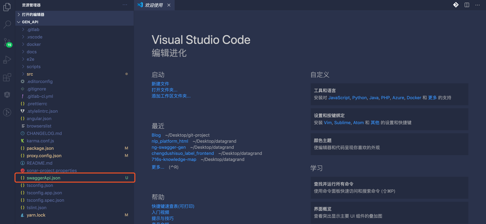
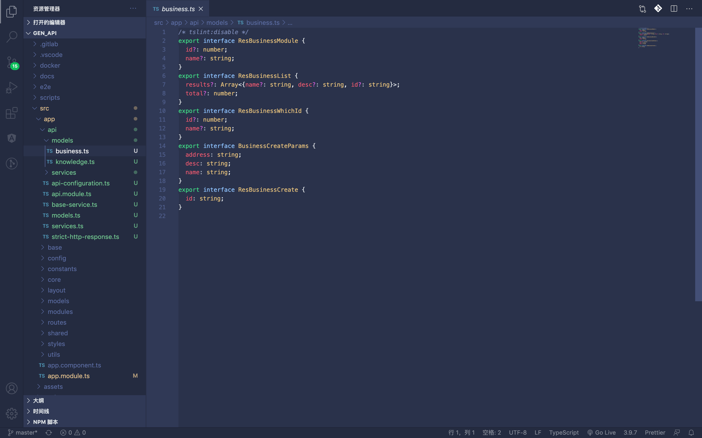

# cli-yapi-gen

cli-yapi-gen: A Swagger 2.0 code generator for Angular

> Generate api services from swagger.json. Based on [ng-swagger-gen](https://github.com/cyclosproject/ng-swagger-gen)

## 方式一：通过 dg-cli 生成 yapi 接口文档对应的前端 http service 代码

> 如果接口文档是在 yapi 上，并且你需要生成其项目的所有接口代码。那么，这个方式更适用于你。（注意：目前仅在 dg-cli 生成的项目中进行过测试）

### 1.1 安装 dg-cli

首先检查本地是否安装`dg-cli`，

```bash
dg-cli -v
```

如已经安装，检查版本号是否为最新，并自动升级

```bash
dg-cli upgrade
```

如未安装，则全局安装即可

```bash
npm i -g dg-cli@git+ssh://git@git.datagrand.com:58422/web/dg-cli.git#{tag}
```

### 1.2 generate api 生成代码

```bash
dg-cli generate # 显示可生成工具列表，选择api
```


根据提示信息，输入`yapi`文档地址和代码生成路径


期间会对部分依赖进行安装，安装完成后自动生成代码，如下：


## 方式二：通过 cli-yapi-gen 生成对应 swagger.json 文件的前端代码

>  如果你已经导出了 swagger.json 文件，或者只需要 yapi 上对应项目的部分接口来生成代码。可以考虑使用这个方式。

### 2.1 全局安装 cli-yapi-gen

```bash
npm install -g cli-yapi-gen@git+ssh://git@git.datagrand.com:58422/liyi/cli-yapi-gen.git#{tag} # 目前最新是0.1.0
```

### 2.2 前往 yapi，导出 swaggerApi.json 文件


### 2.3 将成功导出的 swaggerApi.json 文件 copy 指项目根目录



### 2.4 根据自己的需求，对 swaggerApi.json 文件进行修改

由于 swaggerApi.json 拥有该项目的所有接口。如果自己只想生成新模块的代码，则需要手动删除老的接口。

### 2.5 生成代码

前往你的项目根目录，执行命令。如果成功，项目中便会生成 src/app/api 文件夹。如果希望自定义输出路径，则需要 `-o`参数。更多参数请参考https://github.com/cyclosproject/cli-yapi-gen

```bash
cd your-project
cli-yapi-gen -i your-swagger-json # your-swagger-json为你的swaggerApi.json的相对路径，在例子中我们应写为 cli-yapi-gen -i ./swaggerApi.json
```

## 项目结构梳理

接下来，我们来一起看看咱们的代码变更。

### src/app/api

代码生成目录

```
.
├── api-configuration.ts # api配置信息
├── api.module.ts # api模块
├── base-service.ts # api基础服务，用于其他模块继承
├── models
│   ├── business.ts # 根据yapi模块分类，生成的business接口
│   └── knowledge.ts # 根据yapi模块分类，生成的knowledge接口
├── models.ts # 接口的公共出口
├── services
│   ├── business.service.ts # business模块http请求代码
│   └── knowledge.service.ts # knowledge模块http请求代码
├── services.ts # service公共出口
└── strict-http-response.ts # 全局接口返回类型约束
```




### package.json(dg-cli)

我们会在`package.json`中记录本次`swaggerapi.json`对应的`yapi接口文档地址`。便于使用时，默认填充。不用再去手动 copy yapi 文档地址。


#### proxy.config.json(dg-cli)

自动更新`proxy.config.json`文件，将`/api`代理更新为目标接口文档对应的 mock 地址。


#### app.module.ts(dg-cli)

在`app.module.ts`文件中自动引入`api.module.ts`。保证大家开箱即用。在项目中直接调用 service 请求代码即可。


## 注意事项

使用前，请务必了解这些注意事项。能避免你踩绝大多数坑。https://git.datagrand.com/web/dg-cli/issues/8

